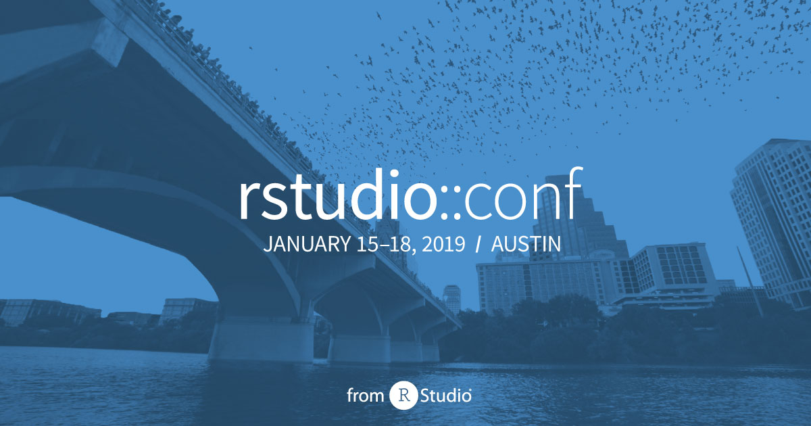

# rstudio::conf 2019

.pull-left[
- Watch the sessions 
 + https://resources.rstudio.com/rstudio-conf-2019

- All abstracts/workshops/e-posters
 + https://github.com/rstudio/rstudio-conf/tree/master/2019 
]

.pull-right[

]

