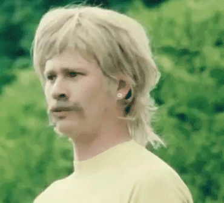
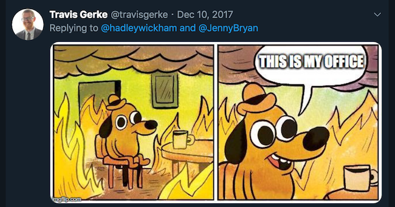
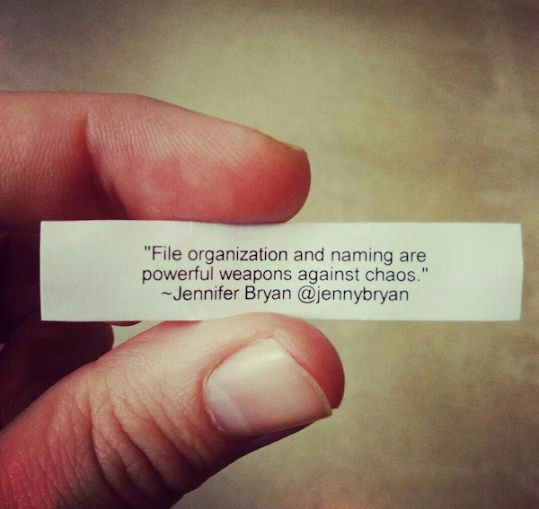

background-image: url(figures/slideshow.png)
background-size: 50%
background-position: bottom 10% right 10%

# rstudio::conf 2019

.pull-left[
- Watch the sessions 
 + https://resources.rstudio.com/rstudio-conf-2019

- All abstracts/workshops/e-posters
 + https://github.com/rstudio/rstudio-conf/tree/master/2019 
 
- Focus of this presentation
 + What they forgot to teach you about R workshop (Bryan/Hester)
]

---

background-image: url(figures/dashboard.png)
background-size: 90%
background-position: bottom 10% center

# The Twitter dashboard &#x1F92F;

- Created by one of our own &#x1F44F; &#x1F44F; &#x1F44F; &#x1F44F;
 + Built with **shiny, shinydashboard, rtweet, plotly, tidyverse**
 + Perhaps Garrick will give us a walkthrough in the future &#x1F609;
 + https://apps.garrickadenbuie.com/rstudioconf-2019/
 
---

background-image: url(figures/leaderboard.png)
background-size: 65%
background-position: right 10% center

# The Game:

--
.pull-left[
* One person in this list <br> sucks at Twitter <br> and doesn't belong!!!
 + Rhymes with turkey
]

---

background-image: url(figures/tweetwin.png)
background-size: 30%
background-position: bottom 30% right 40%

# Huh?



---
background-image: url(figures/thread0.png)
background-size: 50%
background-position: bottom 30% right 40%

# Tired/wired note-taking

* This thread walks through 15 hacks I noticed in the workshop
 + All consisted of some task that I've been doing "tired-style" for years
 + LET'S GET WIRED
 
.footnote[https://twitter.com/travisgerke/status/1086253813210775553]

---
background-image: url(figures/01.png)
background-size: 70%
background-position: center

# 1: Use `here::here()`

---
background-image: url(figures/setwd-JB.jpeg)
background-size: 50%
background-position: bottom 30% center

# This &#x1F525; started by Jenny Bryan 

---
background-image: url(figures/setwd.png)
background-size: 30%
background-position: bottom 30% right 10% 

# Me:



---
# What `here:here()` solves

* Imagine I send you this script
```{r eval=FALSE}
setwd("~/Desktop/projectRando/temp/")
dat <- read_delim("data/finalfinalv23.txt")
```
* Enjoy your afternoon refactoring (esp if you're on a Windows machine)!!!


* Instead, `here::here()` launches you into a local working directory via Rstudio projects`*`
 + Also writes paths in a OS safe manner
 + More complete argument https://www.tidyverse.org/articles/2017/12/workflow-vs-script/
 + Subtle advantage over `file.path()` that has to do with how `.Rmd` sets paths https://malco.io/2018/11/05/why-should-i-use-the-here-package/
 
.footnote[`*` Most often through `.Rproj`, though there are other ways e.g. `.here` files]

---
background-image: url(figures/02.png)
background-size: 70%
background-position: center

# 2: Use Alfred

---
background-image: url(figures/alfred.png)
background-size: 25%
background-position: bottom 10% center

# Alfred is Mac-specific (sorry Windows &#x1F3BB;)

* Alfred (https://www.alfredapp.com) is a productivity app
 + Through customizable hotkeys or keywords, you can customize how your Mac searches files or opens applications
 + Most useful for prioritizing `.Rproj` files on search (rather than 100s+ of other docs)
 + Here's Hadley Wickham describing his usage https://twitter.com/hadleywickham/status/968624630276804608
 
---
background-image: url(figures/03.png)
background-size: 70%
background-position: center

# 3: File naming is important!

---
background-image: url(figures/freezer.png)
background-size: 40%
background-position: bottom 30% right 10% 

# The guru:



---
background-image: url(figures/04.png)
background-size: 60%
background-position: center

# 4: Load scripts with `callr`

---
background-image: url(figures/callrex.png)
background-size: 60%
background-position: bottom 10% center

# What `callr` solves

* When you source, `callr` (https://github.com/r-lib/callr) lets you perform computations in a separate R process without affecting the current R process
 + Consider the below example 
 
---
background-image: url(figures/05.png)
background-size: 60%
background-position: center

# 5: Use fancy fonts